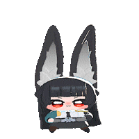

# osuJAM



> 目前使用的動畫素材來自 **[@nn161_9](https://x.com/nn161_9)**。

[English](README.md) | 中文

**osuJAM** 是一個專為 osu! 設計的高效能動畫同步遮罩 (Overlay)，可於 OBS 或瀏覽器中流暢運行。

不同於單純改變播放速度的 GIF 播放器，osuJAM 透過讀取 osu! 譜面的 **Timing Points (紅線)** 來進行「絕對時間映射」。這確保了無論 BPM 如何變換，動畫的關鍵影格永遠準確地落在節拍上。

## 🛠️ 前置需求

你需要安裝以下任一工具來輸出 osu! 的 WebSocket 資料：
1.  **[osu!]** (遊戲本體)
2.  **[Tosu](https://github.com/tosuapp/tosu)** 或 **[gosumemory](https://github.com/l3lackShark/gosumemory)**
    * 請確保 WebSocket 運作於預設端口：`ws://127.0.0.1:24050/ws`。

## 📂 安裝與設定

1.  **下載** 此專案檔案。
2.  **準備圖片素材**：
    * 將你的動畫序列圖檔放入 `./images/` 資料夾。
    * 命名規則：`gif-0.png`, `gif-1.png` ... `gif-80.png`。
    * *註：圖片總數與關鍵幀邏輯可在 `index.js` 中修改。*
3.  **啟動 Gosumemory/Tosu** 並打開 osu!。
4.  直接用瀏覽器開啟 `index.html` 進行測試。

## 🎥 OBS 使用方法

1.  開啟 OBS Studio。
2.  新增 **瀏覽器 (Browser)** 來源。
3.  在 **URL** 欄位輸入 `index.html` 的路徑。
    * 本地檔案範例：`file:///C:/path/to/osuJAM/index.html`
4.  設定適合的寬度與高度。
5.  勾選「場景啟用時重新整理瀏覽器」。

## ⌨️ 操作控制

點擊視窗（或在 OBS 對瀏覽器來源進行互動）即可使用快捷鍵：

| 按鍵 | 動作 | 說明 |
| :--- | :--- | :--- |
| **`d`** | 切換除錯模式 | 顯示/隱藏資訊面板 (BPM, FPS, Offset 等)。 |
| **`+`** | 增加 Offset | 增加 **1ms** 延遲 (若動畫比音樂**快**時使用)。 |
| **`-`** | 減少 Offset | 減少 **1ms** 延遲 (若動畫比音樂**慢**時使用)。 |

## ⚙️ 進階設定

### URL 參數
你可以在網址後方加上參數來設定預設的延遲時間，以配合你的直播環境或硬體延遲。

* `index.html?offset=50` (讓動畫延後 50ms)
* `index.html?offset=-20` (讓動畫提早 20ms)

### 程式碼設定 (`index.js`)
你可以修改檔案頂部的常數來適配不同的素材：
```javascript
const IMAGE_COUNT = 81; // 圖片總張數
const IMAGE_KEY = [...]; // 定義每一拍的起始關鍵幀 (Loop Mapping)
````

## 📝 授權

此專案為開源項目，歡迎隨意修改與分享！

## 🤝 致謝 (Credits)

  * 程式碼重構與邏輯優化由 **Google Gemini AI** 協助完成。
